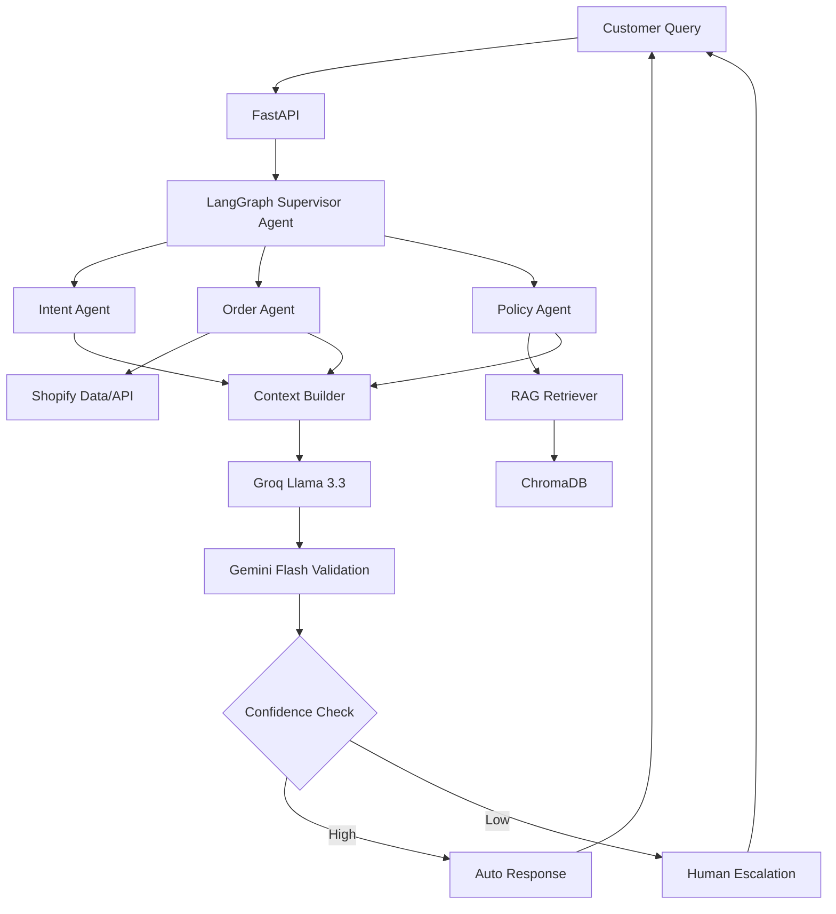

# Shopify Customer Support Intelligence Agent


**Overview:**
- **Shopify_AI** is a modular Python project that orchestrates agents, retrieval-augmented generation (RAG), and service integrations to automate ticket handling, order lookups, policy retrieval, and escalations for Shopify merchants.

**Key Features:**
- **Multi-agent architecture:** intent, order, policy, reasoning, validation, supervisor agents.
- **RAG support:** embeddings, retriever, and vector store for knowledge search.
- **Pluggable models:** adapters for Gemini, Groq, or other LLMs.
- **Services integration:** Shopify API, ticketing, escalation logic.

**Architecture Flow**



Quick links:
- Project entry: `app/main.py`
- Frontend: `app/frontend.py`
- Agents: `app/agents/`
- RAG: `rag/`
- Models: `models/`

**Quickstart (Development)**

Prerequisites:
- Python 3.10+ (use virtualenv)
- pip

Install dependencies:

```bash
python -m venv .venv
source .venv/bin/activate  # macOS / Linux
 .venv\Scripts\Activate    # Windows PowerShell
pip install -r requirements.txt
```

Run the API locally (example):

```bash
python -m app.main
# or if using uvicorn/fastapi:
# uvicorn app.main:app --reload --host 0.0.0.0 --port 8000
```

Run tests:

```bash
pytest -q
```

**Docker**

Use this minimal `Dockerfile` as a template:

```dockerfile
FROM python:3.11-slim
WORKDIR /app
COPY requirements.txt ./
RUN pip install --no-cache-dir -r requirements.txt
COPY . /app
ENV PYTHONUNBUFFERED=1
EXPOSE 8000
CMD ["uvicorn", "app.main:app", "--host", "0.0.0.0", "--port", "8000"]
```

Build and run locally:

```bash
docker build -t shopify_ai:latest .
docker run --rm -p 8000:8000 \
  -e OPENAI_API_KEY="your_key" \
  -v $(pwd)/data:/app/data \
  shopify_ai:latest
```

docker-compose (example) `docker-compose.yml` snippet:

```yaml
version: '3.8'
services:
  web:
    build: .
    ports:
      - "8000:8000"
    environment:
      - OPENAI_API_KEY=${OPENAI_API_KEY}
    volumes:
      - ./:/app
```

**Streamlit (optional UI)**

If you want a quick interactive UI using Streamlit, create a simple `streamlit_app.py` (example):

```python
import streamlit as st
st.title('Shopify AI — Support Assistant')
question = st.text_input('Customer question')
if st.button('Ask'):
    st.write('Sending to API...')
    # call your API endpoint here, e.g. requests.post('http://localhost:8000/route', json={...})

# Run: `streamlit run streamlit_app.py`
```

Run Streamlit:

```bash
pip install streamlit
streamlit run streamlit_app.py
```

**Git / GitHub: commit & push commands**

Set up and push to GitHub (replace `USERNAME/REPO`):

```bash
git init
git add .
git commit -m "chore: initial project import"
git branch -M main
git remote add origin git@github.com:USERNAME/REPO.git
git push -u origin main
```

If you prefer HTTPS remote:

```bash
git remote add origin https://github.com/USERNAME/REPO.git
git push -u origin main
```

**Repository layout**

- `app/` — application entrypoints and agents (`app/main.py`, `app/frontend.py`, `app/agents/`)
- `api/` — route definitions and request/response schemas
- `models/` — model clients and router
- `rag/` — embeddings, retriever, vector store
- `services/` — shopify, ticketing, escalation
- `data/` — embeddings, policies, tickets, orders
- `tests/` — unit/integration tests

**Environment & Secrets**
- Store secrets in environment variables. Example: `OPENAI_API_KEY`, `SHOPIFY_API_KEY`, `SHOPIFY_SECRET`.
- Consider using `.env` and `python-dotenv` in development.

**Contributing**
- Please open issues and PRs. Follow the repo's coding style and testing.

**License**
- Add a license file (e.g., MIT) if you plan to open-source this repository.

----

If you'd like, I can also create the `Dockerfile` and a `streamlit_app.py` in the repo now — tell me to proceed.

This prototype automates Shopify-style customer support tickets with a multi-agent workflow:

- Supervisor agent decides which steps to run.
- Intent agent classifies the ticket.
- Order agent retrieves sample Shopify order data from `data/orders/orders.json`.
- Policy agent retrieves relevant policy text from `data/policies`.
- Reasoning agent generates a grounded customer response.
- Validation agent checks policy grounding.
- Escalation service sends low-confidence or unsafe cases to human support.


## Run Locally


```bash
pip install -r requirements.txt
python -m app.rag.ingest
uvicorn app.main:app --reload
```

Open `http://127.0.0.1:8000/docs` for the API docs.

Run the Streamlit frontend in a second terminal:

```bash
streamlit run app/frontend.py
```

## Example Request

```bash
curl -X POST http://127.0.0.1:8000/api/tickets \
  -H "Content-Type: application/json" \
  -d '{"customer_id":"cust_001","message":"My order #1234 is delayed. Can I get a refund?"}'
```

The project runs with deterministic local fallbacks by default. Add API keys in `.env` when wiring real Groq, Gemini, and Shopify integrations.

## RAG Pipeline

The policy RAG flow uses:

- `RecursiveCharacterTextSplitter` for chunking policy, FAQ, and product manual files.
- `BAAI/bge-small-en-v1.5` from Hugging Face through `sentence-transformers`.
- Persistent Chroma DB stored at `data/embeddings/chroma`.
- Metadata per chunk, including source file, document type, chunk index, path, and character count.
- `BAAI/bge-reranker-base` as a cross-encoder reranker after vector retrieval.

Build or rebuild the vector DB:

```bash
python -m app.rag.ingest
```

Check the vector DB from the API:

```bash
curl http://127.0.0.1:8000/api/rag/status
```

Rebuild from the API:

```bash
curl -X POST http://127.0.0.1:8000/api/rag/ingest
```
